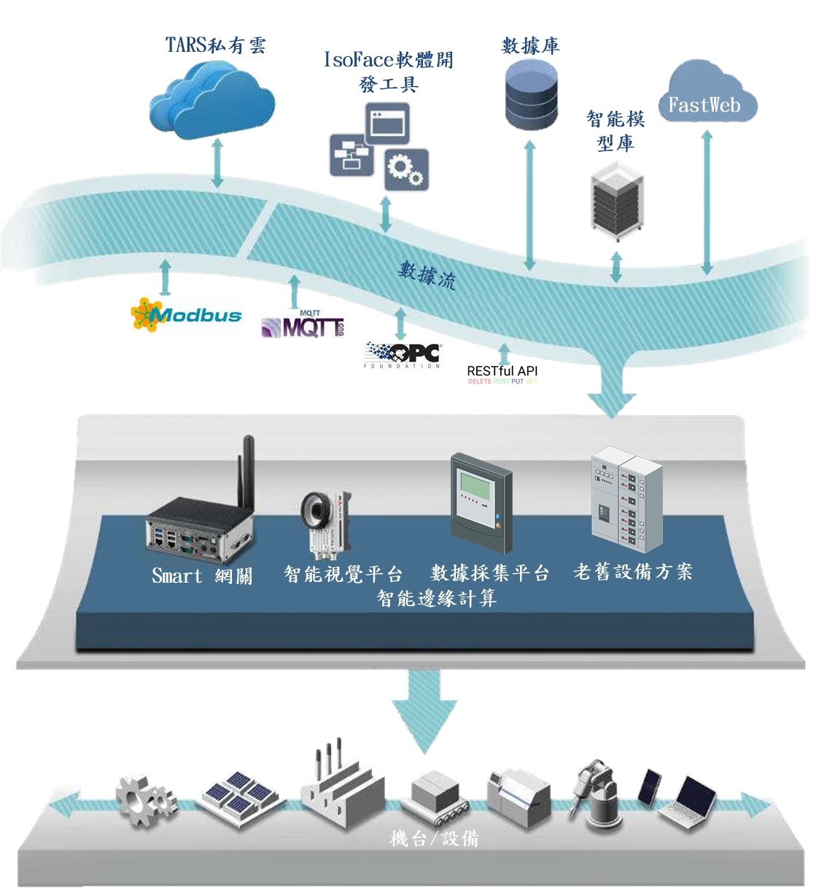
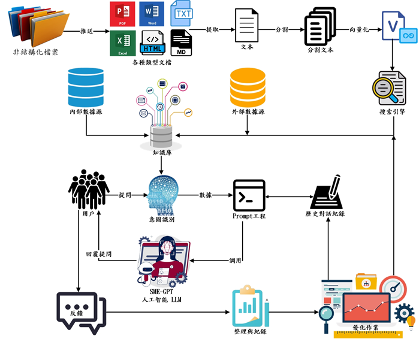
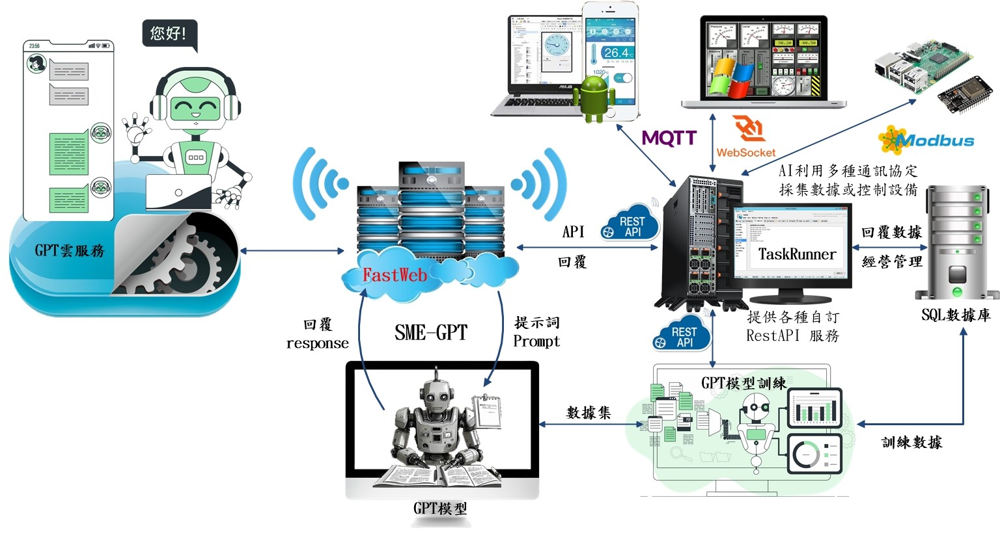
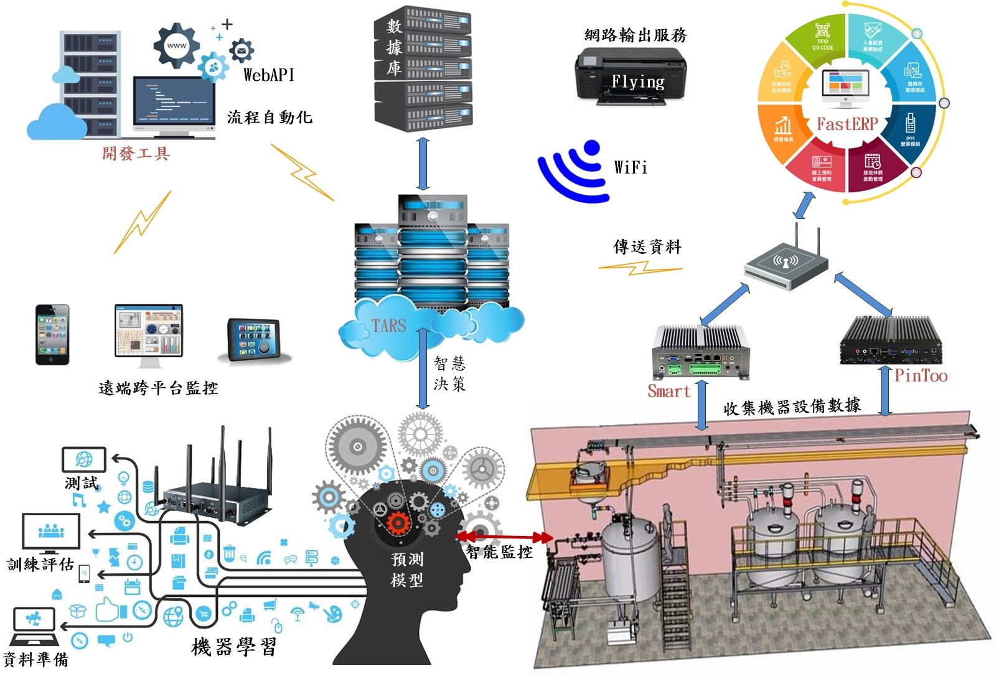
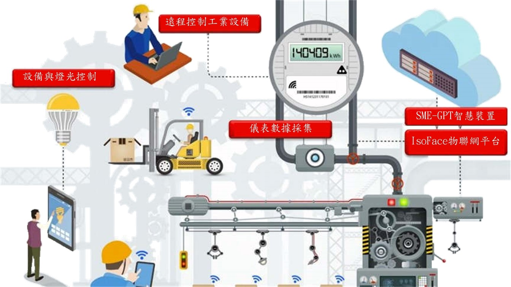

# SmeGPT智控平台，中小企業使用的 GPT

隨著人工智慧逐漸成熟，ChatGPT自推出後受到全球矚目，憑藉其強大的語言生成和理解能力，與使用者進行自然而流暢的對話。這引起了企業廣泛的興趣，探索使用AI對話方式，強化與客戶互動關係。愛招飛意識到AI技術的重要性，立即運用 FastWeb開發AI管理系統SmeGPT，採用無程式碼概念。使用視覺化操作，簡化AI流程，並以Web監測運算過程，實現資源使用最大化，大幅降低硬體建置成本與AI技術門檻。解決ChatGPT的局限性，更適合中小企業使用。

SmeGPT創造產業未來，使用智慧創新，提高企業對AI技術的應用能力，同時透過交流激發創新思維，培育更多具有競爭力的企業。面對經濟不明朗的挑戰，數位轉型是中小企業迫切的任務。SmeGPT以AI與雲端技術為基礎，探究資料工程與提高數據處理效率，促使管理更快速便捷。並以低成本方式，與FastWeb，進行多方面的搭配，逐步拓展企業數位轉型。以簡單的對話，進行資料分析，自動回覆企業管理需求。

SmeGPT利用型大型語言模型，提供中小企業虛擬智慧助理，應用於企業管理等領域，其特色如下：

## 自行微調訓練大語言模型，降低成本

在企業模型微調訓練的過程，都是專業技術經驗的累積。模型訓練學習，所需參數不一定要多，複雜度也不用高，重點在於收集產業專業知識。SmeGPT 提供AI模型訓練功能，可學習更廣泛的技術知識領域，有效創建答案，提高工作效率。SmeGPT協助企業定制專業的智能助理，自動回覆各類問題或自動運行某些特定功能。例如使用預先定義的流程執行各種交易或分析流程，同時在系統上運行。只要具備產業經驗，就可構建具體場景的小模型，滿足生產環節對AI的需求，建立企業在AI領域的中長期優勢。

## 自訂API專業需求，創新的 AI 生態系統與其它系統或數據整合

將基礎模型連接各種 API，利用語言模型對API 進行調用，串接不同任務完成一系列的工作。這些 API 可連接 ERP、IOT、SCADA、SQL…等各種應用資源。自訂查核企業各種交易訊息，例如檢查交易紀錄、跟蹤出貨狀況、安排生產計劃以及其他一般查詢。SmeGPT 可以整合任何數據庫，使用上下文的對話設計，為企業量身定制各種 AI服務。SmeGPT不使用ChatGPT系統，不但降低AI使用成本，還能獨立自主靈活運用，滿足企業特定的需求。SmeGPT利用FastWeb 設置 API 平臺，所有開發者都可將新的模型或者 API接入，它類似GPT指揮中心，運行各類型任務。

## 同時使用多種大語言模型，靈活自動切換，滿足企業不同的專業需求。

支援多種不同專業領域的大語言模型，當企業面對不同的任務需求時，可在不同的語言模型中切換。

利用大型語言模型的人工智慧功能，協助企業依據管理數據自行切換大語言模型，在內部管理流程或客戶服務運營中使用。自訂的模型可快速、準確、高效地響應客戶詢問，滿足具有挑戰性的需求，從而實現多個任務和流程的自動化，成為企業實體的理想選擇。使用符合企業級需求的 SmeGPT 模塊為企業創造商業價值，特別在改善客戶服務、員工培訓、人力資源、營銷和自動化等領域。提升客戶體驗並使企業能夠提供更快、更有效的服務。

## 即時利用語音向大語言模型提問

支援語音輸入辨識功能，用戶採用語音提問，再交由大語言模型回覆，自行設計類似Siri的功能。

## 使用語音自動回覆用戶提問

支援語音回覆功能，用戶自行設置大語言模型可採用文字或語音回覆。

## 提供軟體二次開發工具

採用所見即所得之設計功能，靈活擴展系統架構，可隨時修改、自由組合設計使用界面，無需使用其它軟體工具，自行開發各種AI應用軟體。

## 提供類微服務功能(IsoBean)，將AI與其它第三方軟體整合。

提供控件、函數、擴展...等基礎組件。再利用組件整合成模塊、表單、微服務等半成品。協助用戶簡化開發過程，加速AI軟體產品開發時程。

## 監控大語言模型與電腦運行狀況

隨時監控電腦CPU、記憶體、顯卡GPU使用率，超過警戒範圍立即發出警告訊息。

## 本地安裝、保障企業數據安全

SmeGPT提供小型並在商業上可運行的模型，保有大型語言模型的準確性。部署在企業內部服務器，進行內部實施。可在內部網路運行，無須對外交付企業數據，降低訓練成本。模型訓練資料無論是經營資料、生產資料都是企業重要的商業機密。雖然雲端服務和SaaS已經在業界廣泛使用，但是許多傳統行業，還是偏好在本地部署自己的服務，都不願意冒著資料洩露的風險把資料放在雲端，擁有行業資料積累的工業互聯網企業具有中長期優勢。SmeGPT將傳統知識庫搜尋介面改造為自然語言問答介面，給一個答案，而不是給多個連結，節省資料查詢時間，「不用上雲端，更不用擔心機密外洩」。

無其它大語言模型的資料保密問題，有效防止企業內部系統數據洩露。

## 提示詞(prompt)優化管理

通過搜索找到最優提示詞(prompt)範本，預留提示詞供用戶輸入，通過提示詞優化就能實現廣泛功能。它將使用者輸入和其它外部資料轉化為適合大語言模型的提示詞，包括以下功能︰

* 提示詞管理、優化和序列化等功能。通過調整提示詞，可以讓大語言模型執行各類任務，如生成文本（包括聊天、問答、摘要、報告等）。

* 對各類不同任務、不同場景、不同語言的提示詞進行管理和優化。將使用者的問題和答案存儲在資料庫，形成使用者問答的歷史紀錄，作為多輪對話任務的大語言模型推理依據。

* 提供大語言模型API管理、意圖識別與整合介面，通過對使用者輸入問題進行語義判斷，自動選擇合適的資料來源來回答使用者提出的問題。

* 保存與模型交互時的上下文狀態，是實現多輪對話的關鍵元件。回饋及優化反覆運算模組，通過記錄有問題的答案，分析方案存在問題，及時在知識庫和提示詞工程上優化。

## 嵌入(Embeddings)技術，建立知識庫的向量資料集

嵌入(Embeddings)是一種將文字或單詞轉換為向量的技術。這些向量可以用作深度學習模型的輸入，並且可以捕捉單詞之間的關係。它包括資料處理、存儲、外部文檔導入等功能，提供API介面、資料庫介面、文本拆分、文本向量化存儲和檢索的介面，非常容易處理各類型的外部資料，給大模型進行推理。匯總各類資料，形成企業的知識庫，包括以下功能︰

* 對非結構資料，主要支援 word、excel、PDF 和 txt 等常見文檔，通過對非結構資料進行文本提取和文本拆分，得到多條文字區塊，經由向量化，得到文字區塊相應的向量，最後將文字區塊和向量存儲到搜尋引擎中。

* 對結構化資料，讀取資料庫取得相應的資料，主要通過規則生成 SQL 語言查詢資料庫。如果需要查詢網路獲取即時資訊，可以讀取 URL 網址的資訊，也可以通過搜尋引擎介面查詢網路即時資訊。

## 任務鏈接(chain)組合與分解功能

對各式GPT功能組合在一起以完成特定的任務，例如一個鏈接(chain)可以包含提示詞模版、大語言模型及輸出處理元件，來完成使用者聊天功能。對各種不同的任務提供不同的鏈接(chain)，同時可自訂鏈接(chain)，它提供不同的模型推理模式，可以根據具體的任務需求，選擇合適的鏈接(chain)以及模型推理模式來完成任務。

## 任務代理(Agents)功能

根據使用者的輸入來決定調用那些工具，同時能組合一系列的鏈接(chain)來完成複雜的任務。

## 搭建聊天機器人

支援微信個人微信、企業微信、公眾號、Line BOT …等通訊軟體整合部署。SmeGPT搭建聊天機器人，採用AI對話式商務技術，打造企業AI行銷客服平臺，透過內建API與GPT語言模型，可直接應用於台灣及全球客戶最常使用的大即時通訊平臺LINE、WeChat以及Web網頁客服對話，客戶在SmeGPT平臺中即可體驗人工智慧技術。提供企業將SmeGPT應用於行銷與客服場域之中，賦能企業進而創造組織與業績成長。整合所擁有的對話數據，透過SmeGPT協助行銷與客服人員以提供更加自然、精準的回覆，幫助行銷人員更快地創建各種類型的內容，全面性提高用戶體驗和滿意度，進而增加銷售量和品牌忠誠度。以「軟體及服務」（SAAS）商業模式，協助企業掌握跨社群平臺對話式行銷科技。

## 無縫銜接 FastWeb所有功能

支援 Modbus、MQTT、WebSocket、RestAPI..通訊協定。採用上百種控件與各式API，整合 SmeGPT、AI、物聯網、SCADA、ERP、微服務，於彈指之間。

## 結合數控中心所有產品

結合數控中心能源管理系統、人車定位系統、設備故障診斷系統、設備最佳運轉效益、燈號管理系統、戰情室、戰情指揮系統。

## 與IsoFace(愛招飛)軟體開發工具相互支援

愛招飛軟體開發工具PinToo、Smart、FastERP、TaskRuner..支援SmeGPT 配合產業需求，自訂 AI專屬解決方案。

## SmeGPT具有巨大的潛力

企業要有效地利用 GPT 等人工智慧技術，與經驗豐富的人工智慧供應商的合作至關重要。這需要人工智慧領域的豐富專業知識。SmeGPT運用人工智慧不斷訓練豐富的專業知識，提供用戶全面體驗的能力。將SmeGPT成為企業、工廠的指揮中心。也是未來企業都需要的 AI大腦，它協助整合不同領域的工業物聯網，更快構建符合具體場景的小模型，以滿足各個生產環節對 AI 的需求。快速生成高品質生產管理數據，指導生產線完成各種複雜的任務，實現更高水準的人機協作。成為數位化企業，和智慧工廠的指揮中心，成為廣泛應用的工業 GPT。

SmeGPT具備工業 GPT 雛形，工廠生產設備管理複雜、資料分析能力要求較高，SmeGPT擁有泛化能力強、知識庫學習、模型高精度三大特性，適合工業應用場景。顯著提升工業資料分析能力與效率，協助企業構建AI生態，成為企業、工廠的指揮中心。SmeGPT在工業領域與 AI 技術應用契合，發展創新應用，包括以下八個應用場景：

* 預測性維護―預測設備何時可能發生故障，實現主動維護，減少停機時間，協助異常事件處理，生成維修或調整機制。
* 品質控制―檢查和測試產品的缺陷，提高產品品質並降低成本。
* 工作流程優化―優化工業流程，例如工作調度和資源配置，生成操作與作業流程，以提高效率和降低成本。
* 機器人技術―控制和自動化工業機器人，提高效率，減少對人力的需求。
* 能源效率―優化能源使用，例如，管理和控制資源的使用，以節省能源。
* 預測分析―分析工業流程中的資料 並預測未來的行為，
* 客服機器人―利用語意溝通於第一線服務客戶。
* 快速統計分析―加速資料檢索或刺激腦力激盪提供新想法。

設備需求：

* 推論只需具備GPU 的筆電，訓練資料要具備RTX-4090-24G 顯卡的電腦。
* SmeGPT採用 Web網頁操作介面，操作方便。
* 提供FastWeb 軟體開發工具，可串接其他系統或自行開發各種專業應用。
* 用戶可自行擴充功能或委託廠商代為訓練。